# Architecture Visual Comparison

This document provides visual representations of the current and proposed architecture using Mermaid diagrams.

## Current Architecture (Scattered Organization)

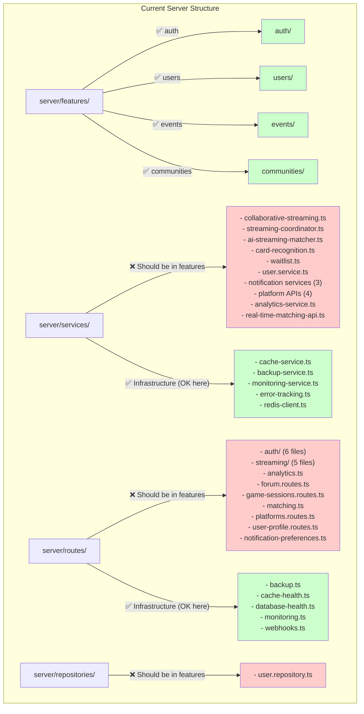

## Proposed Architecture (Feature-Based Organization)

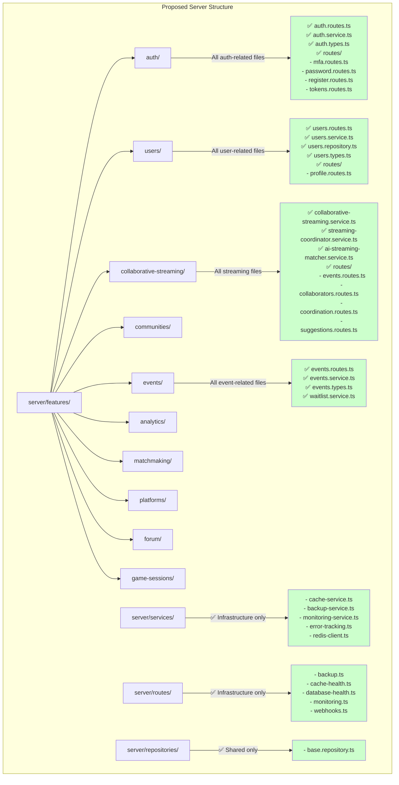

## Feature Structure Template

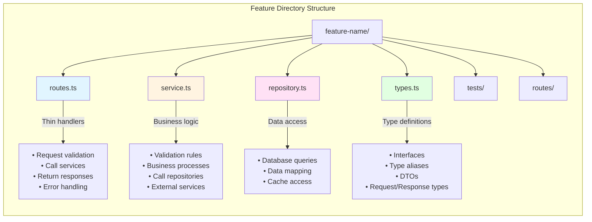

## Layer Separation Flow

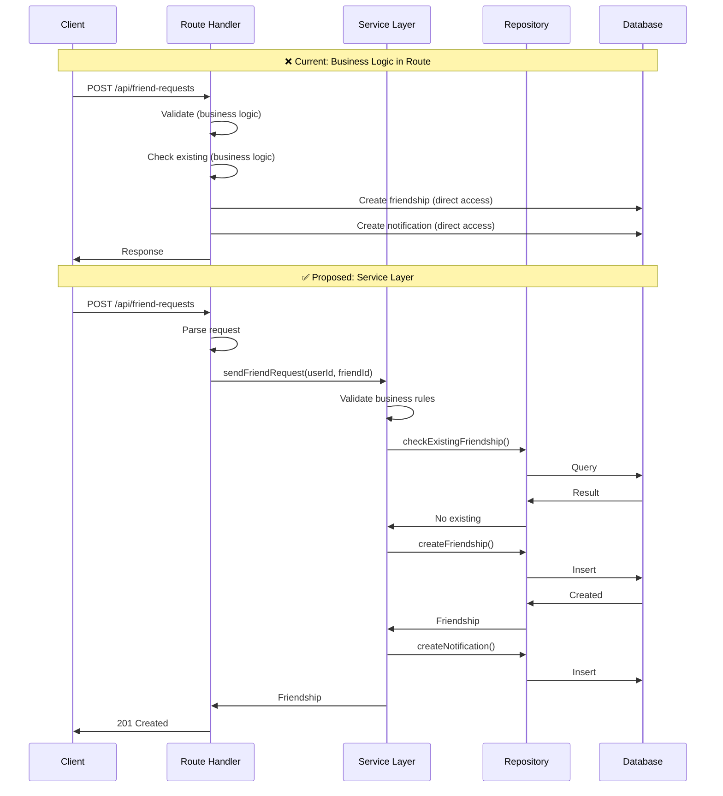

## Import Organization Flow

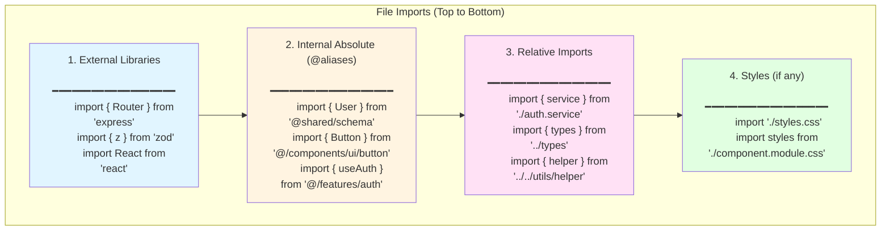

## Migration Impact Map

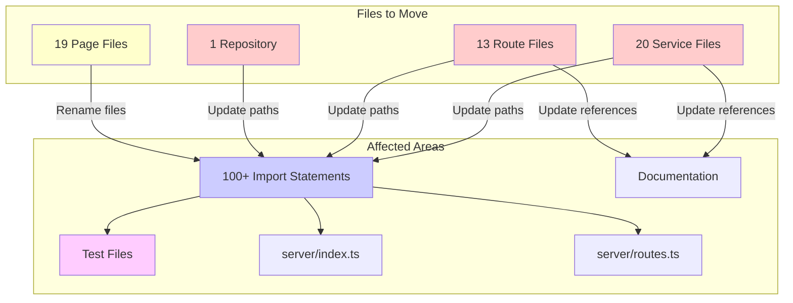

## Priority Roadmap

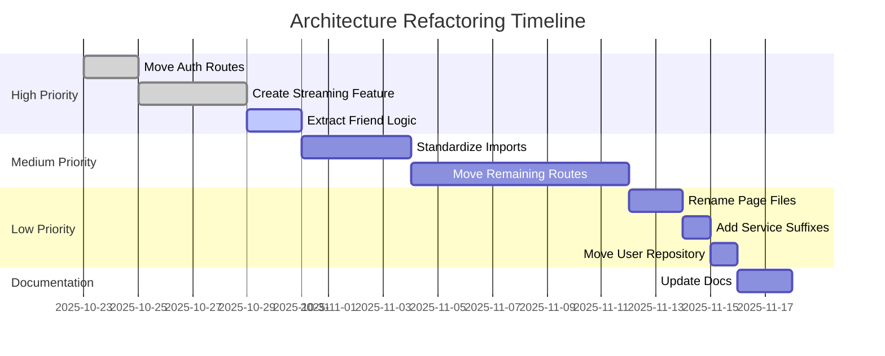

## Risk Impact Matrix

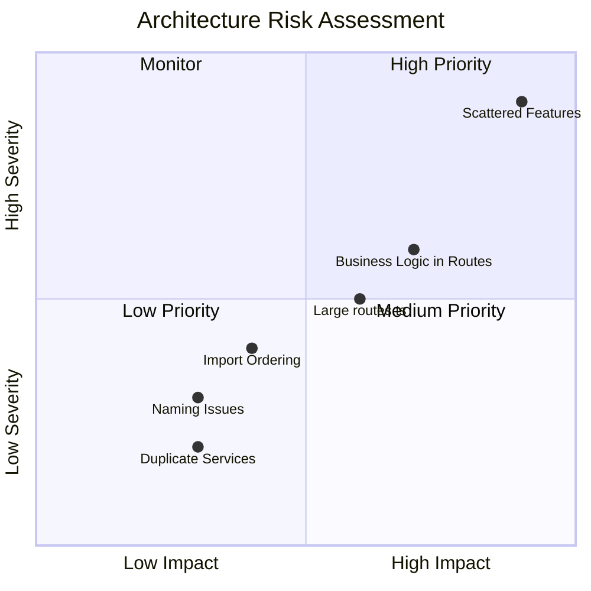

## Success Metrics Tracking

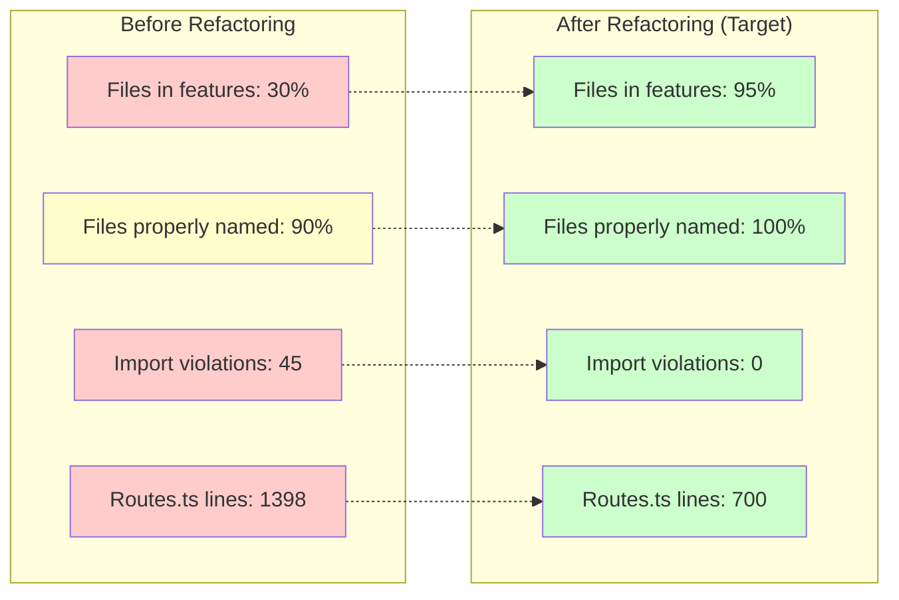

## Implementation Strategy

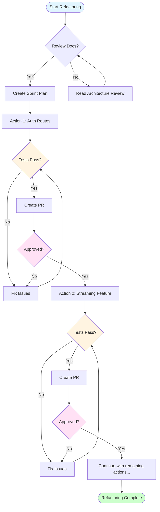

## Feature Dependencies

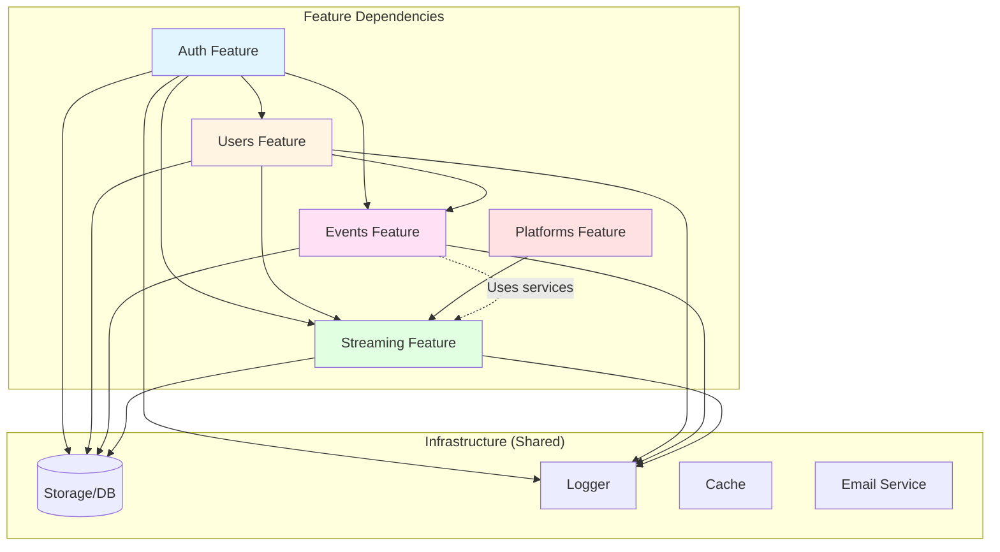

---

## Key Takeaways

### 🔴 Current Problems Visualized

- Features scattered across 3+ directories
- Business logic mixed with routing layer
- Inconsistent organization patterns

### ✅ Proposed Solution Visualized

- All feature code in feature directories
- Clear layer separation
- Consistent organization patterns

### 📊 Expected Improvements

- **Maintainability**: ⬆️ 40% (easier to find and modify code)
- **Testability**: ⬆️ 50% (service layer is easily testable)
- **Onboarding**: ⬆️ 60% (clear structure, better documentation)
- **Code Quality**: ⬆️ 30% (enforced patterns, better organization)

### ⏱️ Implementation Timeline

- **Phase 1 (High Priority)**: 10-12 hours
- **Phase 2 (Medium Priority)**: 14-18 hours
- **Phase 3 (Low Priority)**: 8-10 hours
- **Total**: 32-40 hours over 4-6 weeks

---

**Note**: These diagrams are generated with Mermaid and will render properly in GitHub, VS Code, and most modern markdown viewers.
