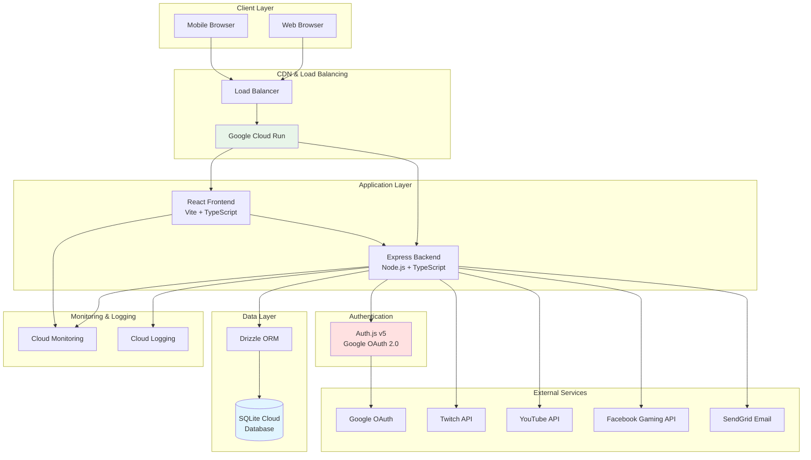
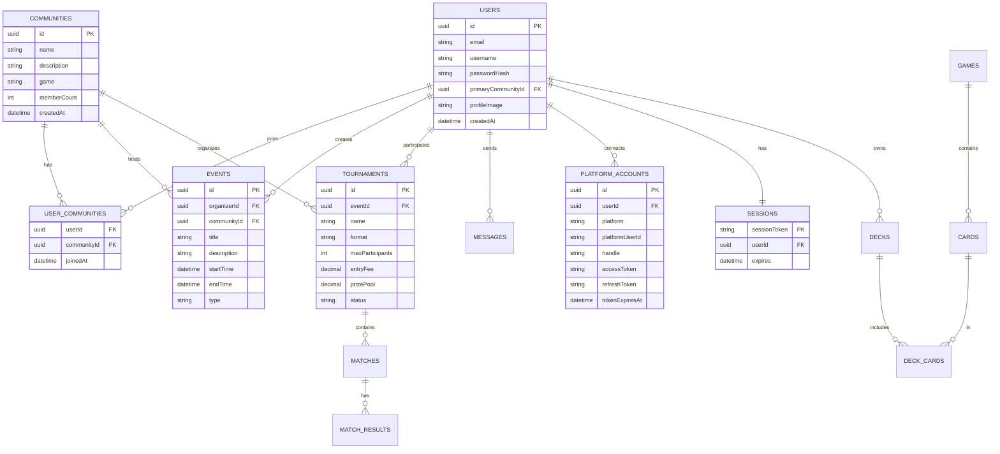
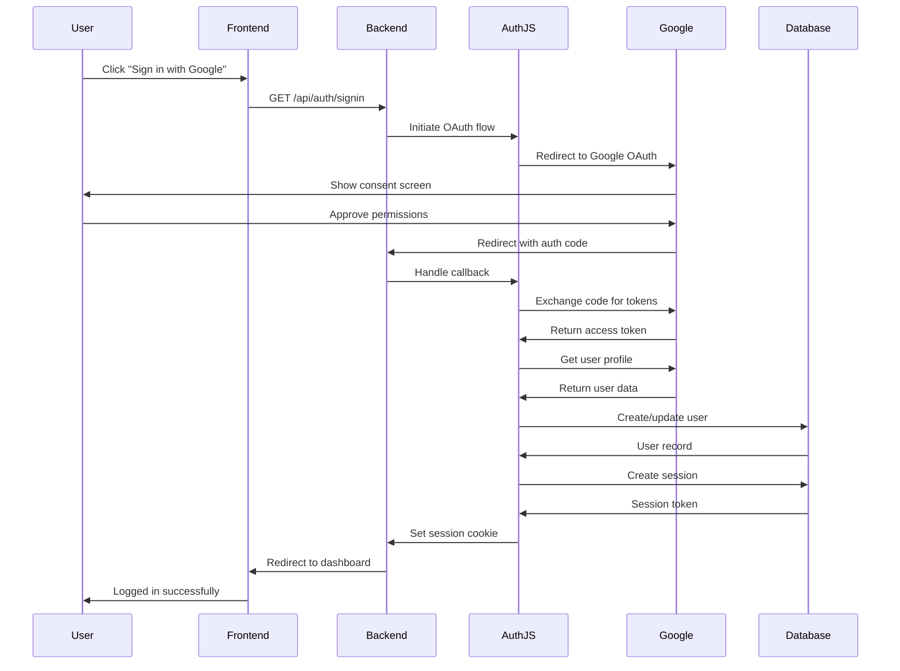
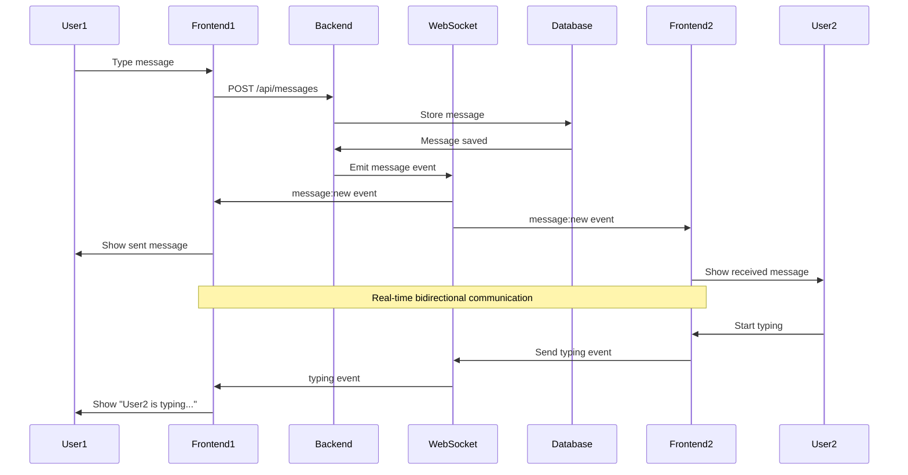
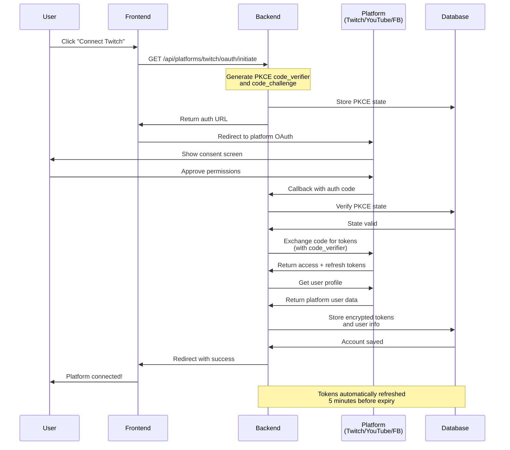
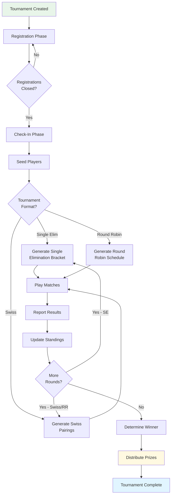
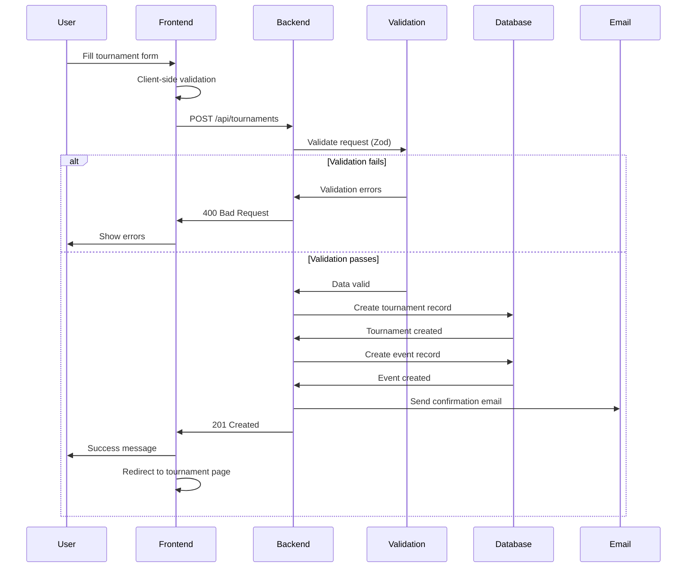
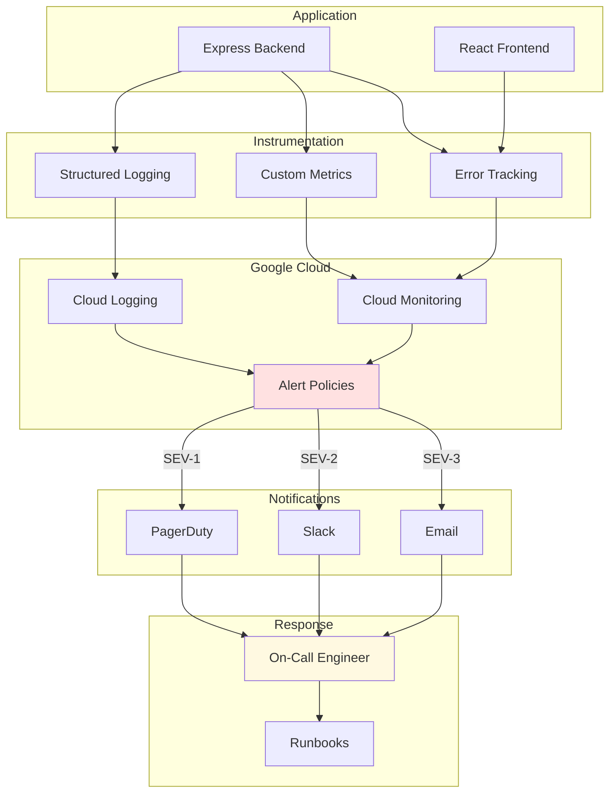
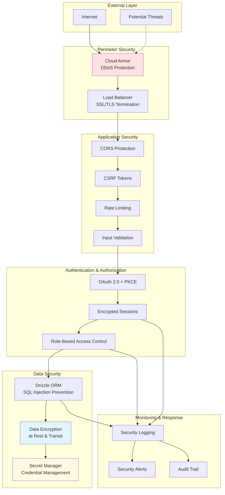

# System Architecture Diagrams

This document contains visual representations of the Shuffle & Sync system architecture.

---

## Table of Contents

- [High-Level System Architecture](#high-level-system-architecture)
- [Database Schema Overview](#database-schema-overview)
- [Authentication Flow](#authentication-flow)
- [Deployment Architecture](#deployment-architecture)
- [Real-Time Communication Flow](#real-time-communication-flow)
- [Platform OAuth Flow](#platform-oauth-flow)

---

## High-Level System Architecture

This diagram shows the overall system architecture and how components interact.



---

## Database Schema Overview

Core database tables and their relationships.



---

## Authentication Flow

OAuth 2.0 authentication flow using Google.



---

## Deployment Architecture

Google Cloud Platform deployment architecture.

```mermaid
graph TB
    subgraph "Internet"
        Users[Users]
    end

    subgraph "Google Cloud Platform"
        subgraph "Cloud Run - us-central1"
            Frontend[Frontend Service<br/>React App]
            Backend[Backend Service<br/>Express API]
        end

        subgraph "Cloud Build"
            CI[CI/CD Pipeline]
            Registry[Container Registry]
        end

        subgraph "Data Storage"
            SQLiteCloud[(SQLite Cloud<br/>Database)]
            Secrets[Secret Manager<br/>Environment Variables]
        end

        subgraph "Monitoring"
            Monitoring[Cloud Monitoring<br/>Metrics & Alerts]
            Logging[Cloud Logging<br/>Application Logs]
        end
    end

    subgraph "External"
        GitHub[GitHub Repository]
        SQLiteProvider[SQLite Cloud Provider]
    end

    Users --> Frontend
    Users --> Backend
    Frontend --> Backend

    GitHub --> CI
    CI --> Registry
    Registry --> Frontend
    Registry --> Backend

    Backend --> SQLiteCloud
    Backend --> Secrets
    SQLiteCloud -.-> SQLiteProvider

    Frontend --> Monitoring
    Backend --> Monitoring
    Frontend --> Logging
    Backend --> Logging

    style SQLiteCloud fill:#e1f5ff
    style Secrets fill:#ffe1e1
    style Frontend fill:#e8f5e9
    style Backend fill:#e8f5e9
```

---

## Real-Time Communication Flow

WebSocket-based messaging system.



---

## Platform OAuth Flow

Streaming platform (Twitch/YouTube/Facebook) OAuth integration.



---

## Tournament Bracket System

Tournament management and bracket generation.



---

## Data Flow: Creating a Tournament

Step-by-step data flow when creating a tournament.



---

## Monitoring and Alerting Flow

How monitoring and alerting works in production.



---

## Security Architecture

Security layers and controls.



---

## Notes

- **Mermaid Diagrams:** These diagrams are rendered automatically in GitHub and many markdown viewers
- **Updates:** Keep these diagrams updated when architecture changes
- **Detailed Docs:** Refer to specific documentation for implementation details
- **Tools:** Use Mermaid Live Editor for editing: https://mermaid.live

---

**Last Updated:** 2025-10-18

**Related Documentation:**

- [Project Architecture](PROJECT_ARCHITECTURE.md)
- [Technology Stack](TECHNOLOGY_STACK.md)
- [Database Architecture](DATABASE_ARCHITECTURE.md)
- [Authentication](AUTHENTICATION.md)
